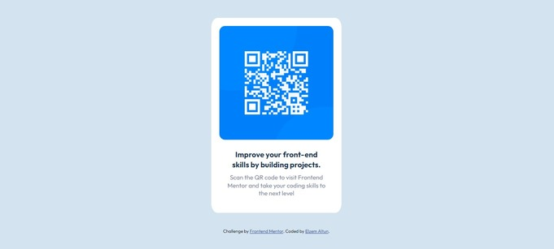

# Frontend Mentor - QR code component solution

This is a solution to the [QR code component challenge on Frontend Mentor](https://www.frontendmentor.io/challenges/qr-code-component-iux_sIO_H). Frontend Mentor challenges help you improve your coding skills by building realistic projects. 

## Table of contents

- [Overview](#overview)
  - [Screenshot](#screenshot)
- [My process](#my-process)
  - [Built with](#built-with)
  - [What I learned](#what-i-learned)
  - [Continued development](#continued-development)
- [Author](#author)

## Overview

### Screenshot

## My process

### Built with

- HTML5 markup
- CSS custom properties
- Flexbox

### What I learned

I am new to Front-end development. Thanks to this challenge, I improve my skills on mostly in CSS. Previously, I have used Bootstap to achive a simple card look. However, this time I used only CSS and this helped me to improve my skills on CSS. Also, I have not use Flexbox in my own project before, so it was nice to see it works in actual projects.

### Continued development

This project was not responsive, therefore, in the future, I would like to make responsive sites and more complex overviews. Moreover, I would like to use grid, and make more eye-catchy web pages.

## Author

- Github - [Elzem Altun](https://github.com/elzemaltun)
- Frontend Mentor - [@elzemaltun](https://www.frontendmentor.io/profile/elzemaltun)
